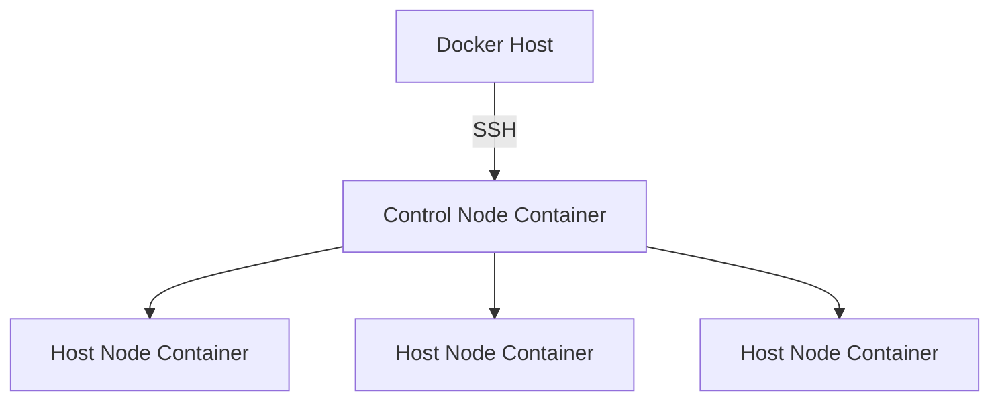

## Ansible Playground
Ansible is an IT automation engine. This is a docker-compose project to quickly get set up with an Ansible control node, and multiple hosts to target with your playbooks.

### SSH Keys
`ssh-keygen` will generate id_rsa and id_rsa.pub on linux or windows.  Put both files in the /keys directory on the docker-compose host before running `docker compose up`.  The public key will be added to the authorized_keys file in the host node image, and the private key will be added to the control node image. 

### Setting up
1) Ensure the keys are in the /keys directory on the docker-compose host.
2) Run `docker compose up` to start the containers.
3) Connect to the control node with `docker attach ansible-playground-control-node-1`
or ssh from your docker host to the control node with user: `ansible` and password: `ansible`
4) Check the connection to the host containers from the control node with `ansible -m ping all'

### Playbooks
Add or edit yml files in the ansible/playbooks/ directory on your docker host machine and they will be available in the control node in realtime.  Run with `ansible-playbook demo.yml`

### Notes
- You can ssh from the control node to the host nodes, just remember to specify the correct user: `ssh root@host2`
- Any changes to the dockerfiles or docker-compose.yml may require the --build flag: `docker compose up --build`

